# CompileUI
## Лабораторные работы по дисциплине "Теория формальных языков и компиляторов"

## Лабораторная работа 7. Анализ и преобразование кода с использованием Clang и LLVM (ЧЕРНОВОЙ)
**Вариант задания:** Прототипы функций

```c++
int sum(int a, int b); // прототип
int main() {
return sum(5, 7);
}
int sum(int a, int b) {
return a + b;
}

```

1. Построение AST 
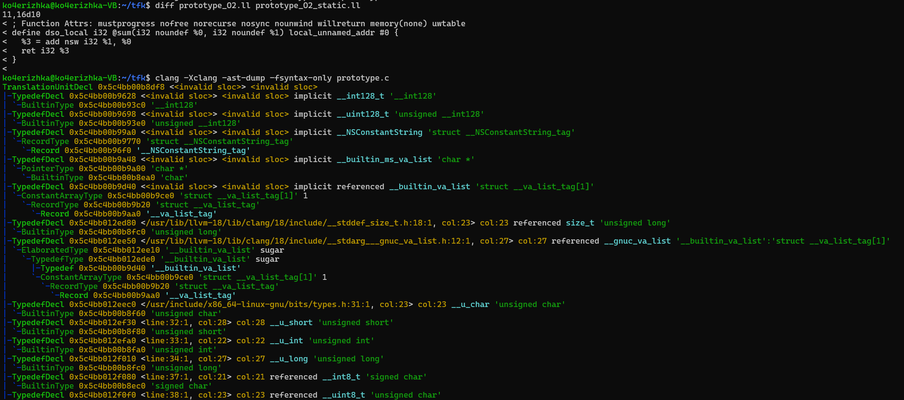

2. Получение IR без оптимизаций
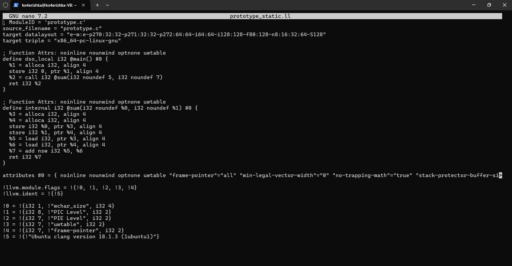

3. Применение -O2
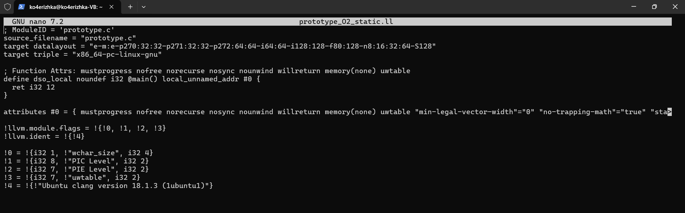

4. Построение CFG для main и sum
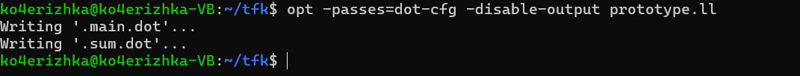

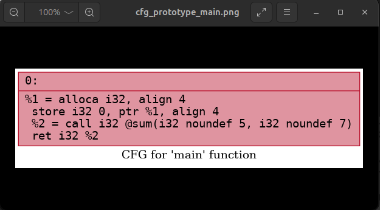


## Лабораторная работа 3. Разработка синтаксического анализатора (парсера)
**Цель работы:** Изучить назначение и принципы работы синтаксического анализатора в структуре компилятора. Спроектировать грамматику, построить соответствующую схему метода анализа грамматики и выполнить программную реализацию парсера с нейтрализацией синтаксических ошибок методом Айронса. Интегрировать разработанный модуль в ранее созданный графический интерфейс языкового процессора.

**Автор:** Косяченко Даниил, АВТ-313

**Постановка задачи:** Разработать синтаксический анализатор (парсер) в соответствии с индивидуальным вариантом курсовой (расчетно-графической) работы, интегрировать его в приложение из лабораторной работы №1 и обеспечить наглядный вывод результатов анализа.

**Вариант задания:** 30. Объявление прототипа функции на языке C\C++ 

*Корректные строки:*

1. void f1();

2. int longNameFunc(int yes);

3. double func123(short da, int net);

*Перечень допустимых лексем:*

1. id (название функции, переменной) 
2. type (тип функции, переменной)
3. Открывающая круглая скобка (
4. Закрывающая круглая скобка )
5. точка с запятой ;

**Разработка грамматики**
```
1. <TYPE_FUNC> → type <AFTER_TYPE>
2. <AFTER_TYPE> -> ' ' <SPACE_AFTER_FUNC_TYPE>
3. <SPACE_AFTER_FUNC_TYPE> → id <AFTER_ID>
4. <AFTER_ID> → '(' <PARAMS>
5. <PARAMS> → ')' <AFTER_RPAREN>
6. <PARAMS> → type ' ' <PARAM_AFTER_TYPE>
7. <PARAM_AFTER_TYPE> → id <PARAM_TAIL>
8. <PARAM_TAIL> → ',' <AFTER_COMMA>
9. <PARAM_TAIL> → ')' <AFTER_RPAREN>
10. <AFTER_COMMA> → type ' ' <PARAM_AFTER_TYPE>
11. <AFTER_RPAREN> → ';'

12. id → letter <ID_TAIL>
13. <ID_TAIL> → letter <ID_TAIL> | digit <ID_TAIL> | '_' <ID_TAIL> | e

Z = <TYPE_FUNC>

type = 'void' | 'int' | 'short' | 'float' | 'double'
Vt = {a, b, ..., z, A, B, ..., Z, 0, 1, ..., 9, (, ), ;, _}
Vn = {<TYPE_FUNC>, <AFTER_TYPE>, <AFTER_ID>, <PARAMS>, <AFTER_RPAREN>, <PARAM_AFTER_TYPE>, <PARAM_TAIL>, <AFTER_COMMA>, <ID_TAIL>, <SPACE_AFTER_FUNC_TYPE>}
```

**Классификация грамматики по Хомскому: Автоматная грамматика**

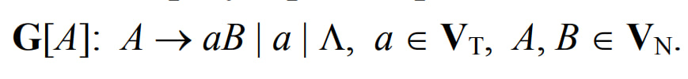

**Граф автоматной грамматики**

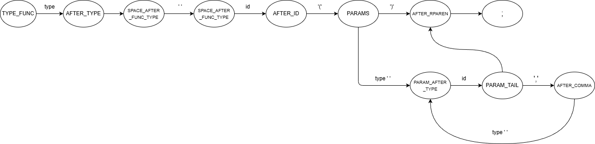


**Диагностика и нейтрализация синтаксических ошибок.**

Метод Айронса заключается в том, что он определяет дефектный куст (фрагмент с ошибками), нейтрализует его (вставляя туда недостающую цепочку) и идет дальше по строке. Таким образом, можно учесть все ошибки.

**Пример работы**
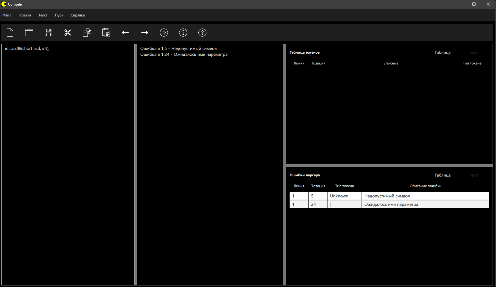
## Лабараторная работа 2. Разработка лексического анализатора (сканера)
**Цель работы** - Изучить назначение и принципы работы лексического анализатора в структуре компилятора. Спроектировать алгоритм (диаграмму состояний) и выполнить программную реализацию сканера для выделения лексем из входного текста. Интегрировать разработанный модуль в ранее созданный графический интерфейс языкового процессора

**Автор:** Косяченко Даниил, АВТ-313

**Вариант задания:** 30. Объявление прототипа функции на языке C\C++ 

*Корректные строки:*

1. void f1();

2. int longNameFunc(int yes);

3. double func123(short da, int net);

*Перечень допустимых лексем:*

1. id (название функции, переменной) 
2. type (тип функции, переменной)
3. Открывающая круглая скобка (
4. Закрывающая круглая скобка )
5. точка с запятой ;

**Диграмма состояний**
letter - латинская буква, digit - цифра от 0 до 9

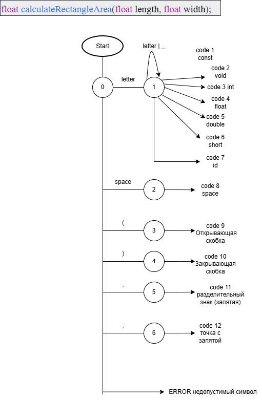

**Тестовые примеры(сканер)**

1. void asd();
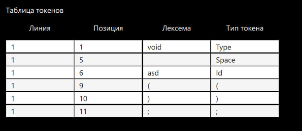

2. int dsa(int net);
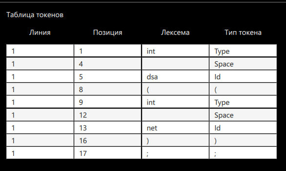

3. void dada(short what, int notWhat);
   int netnet(float yes, double maybe);
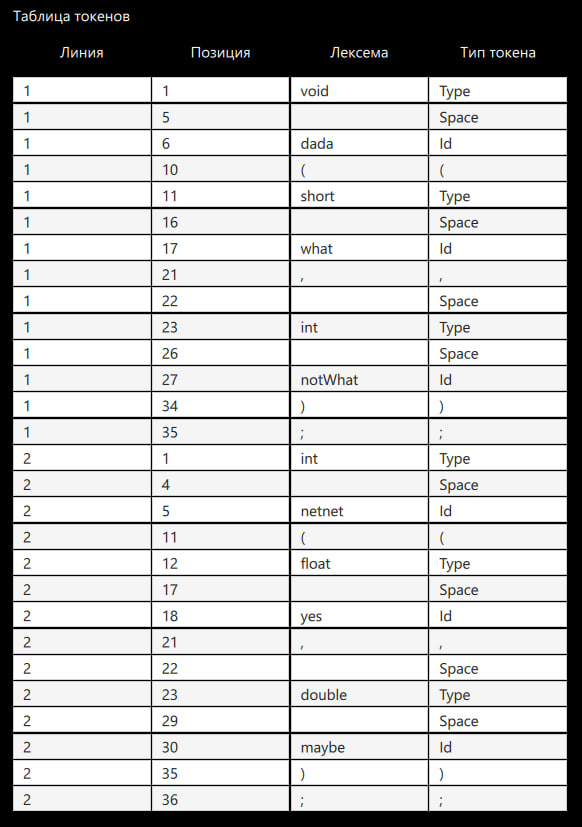


## Лабораторная работа 1. Разработка пользовательского интерфейса (GUI) для языкового процессора 
**Цель работы** - создание кроссплатформенного графического интерфейса (GUI) для языкового процессора в виде специализированного текстового редактора
**Автор:** Косяченко Даниил, АВТ-313
**Описание проекта:** Проект представляет собой текстовый редактор со всеми основными функциями для работы с txt файлами.
**Используемые технологии:** Проект реализован для операционной системы Windows 10\11  с использованием языков программирования С++ и QML (Qt) . Разработан в VS Code
**Для запуска программы необходимо иметь:**
1. Visual Studio 2022\2026
2. CMake
3. Статическую сборку Qt 6.10.2
4. Компиляторо с поддержкой C++17
5. x64 Native Tools Command Prompt for VS 2022
**Сборка проекта**
1. ```bash cmake .. -G Ninja -DC_MAKE_BUILD_TYPE=Release "-DQt6_DIR=ДИРЕКТОРИЯ_С_СТАТИЧЕСКОЙ_СБОРКОЙ_Qt_\lib\cmake\Qt6"```
2.  ```bash cmake --build . --parallel```

**Описание интерфейс и функций:**
1. Основное окно программы

Верхняя панель - это многоуровневое меню со всеми функциями приложения. Под ней панель инструментов, которая дублирует основные функции меню. На панели инструментов есть следующие функции (вызываются при нажатии на иконки): "Создать", "Открыть", "Сохранить", "Отмена", "Повторить", "Вырезать", "Вставить", "Пуск", "Справка", "О программе".

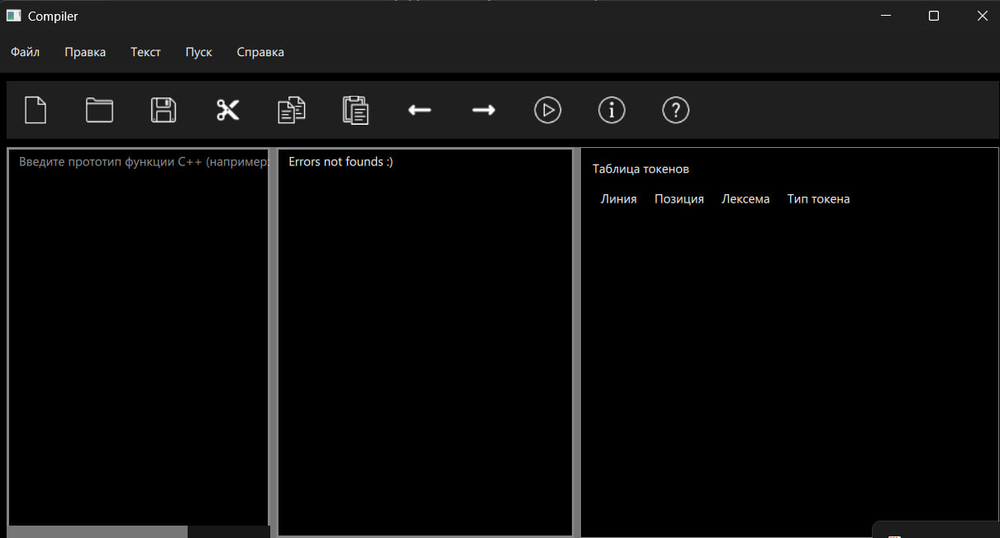

Правее расположено окно редактирования, рядом с ним окно вывода результатов, рядом с окном результатов расположено окно для таблиц. В окне редактирования можно работать с txt файлами с помощью функций текстового редактора, окно вывода результатов показывает отладочные сообщения и ошибки. Окно редактирования нумерует строки и подсвечивает ключевые слова.

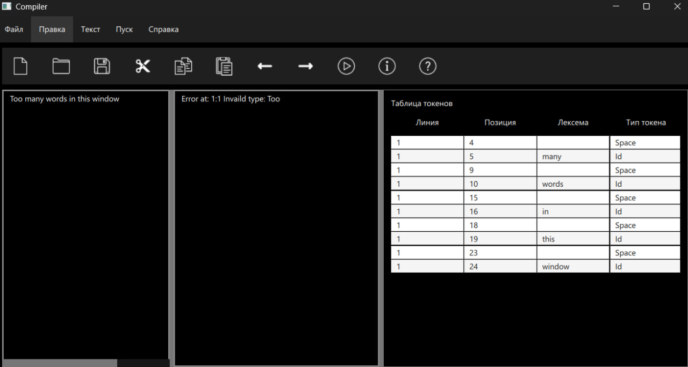

2. Раздел "Файл" и раздел "Правка"

Все функции этих разделов, которые можно вызвать при нажатии на элемент меню, либо с помощью горячих клавиш. Открыть файл можно так же с помощью перетаскивания иконки файла в окно программы.

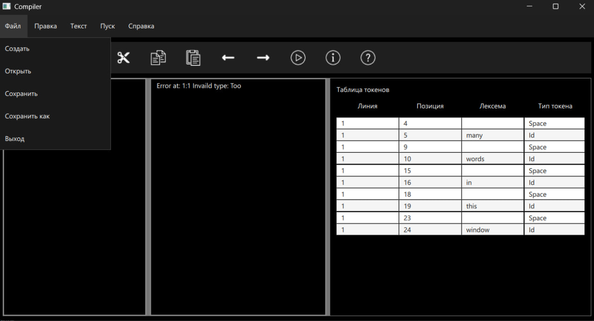

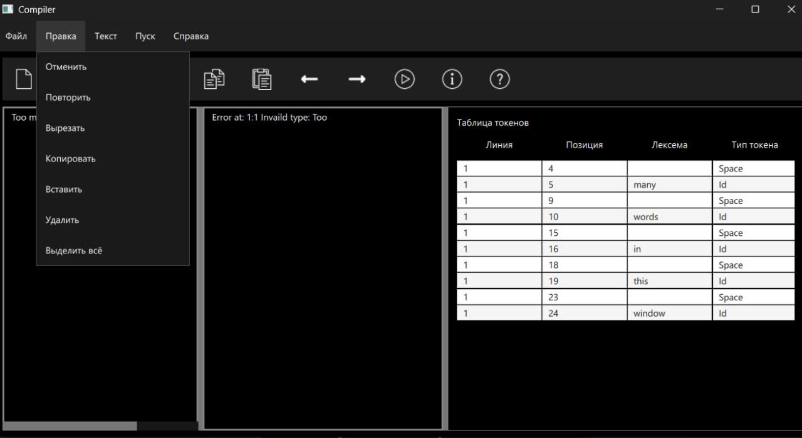

**Ограничения**
1. Данная программа разработана на платформе Windows 10\11. Корректная работа на иных операционных системах не гарантируется
2. Таблица имеет фиксированный размер. Отсутствует возможность "растягивания"
3. Интерфейс не имеет перевода на английский язык


