# CompileUI
## Лабораторные работы по дисциплине "Теория формальных языков и компиляторов"

## Лабораторная работа 7. Анализ и преобразование кода с использованием Clang и LLVM

**Постановка задачи:**
1. Установить Clang и LLVM;
2. Скомпилировать простой C-файл с использованием clang и получить его: абстрактное синтаксическое дерево (AST),  промежуточное представление LLVM IR;
3. Использовать opt для применения базовой комплексной оптимизации (например, О2);
4. Построить граф потока управления (CFG) для оптимизированной программы;
5. Проанализировать результат, сделать выводы и ответить на контрольные вопросы.
6. Выполнить индивидуальное задание в соответствии со своим оператором из КР / РГР.

**Задания:**
1. Постройте AST. Укажите, виден ли на нем прототип.
2. Получите IR без оптимизаций.
3. Примените -O2. Произошло ли встраивание sum?
4. Постройте CFG для main и sum.
5. Исследуйте, что изменится при добавлении static к sum.
6. Сделайте выводы о роли прототипа в оптимизациях.<br>

**Вариант задания:** Прототипы функций
```c++
int sum(int a, int b); // прототип
int main() {
return sum(5, 7);
}
int sum(int a, int b) {
return a + b;
} 
```

1. Построение AST <br>


2. Получение IR без оптимизаций<br>


3. Применение -O2<br>


4. Построение CFG для main и sum<br>
<br>
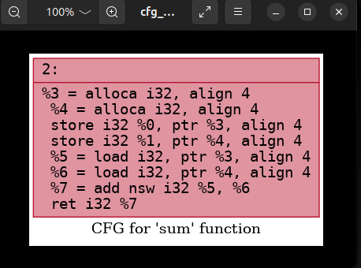<br>
<br>


**Выводы**

1. Что такое Clang, и какова его роль в процессе компиляции программ?
Clang — это фронтенд компилятора для языков C, C++ и Objective-C, который входит в экосистему LLVM. Его роль в процессе компиляции заключается в преобразовании исходного кода на этих языках в промежуточное представление LLVM IR, а также в выполнении лексического, синтаксического и семантического анализа, выдаче диагностических сообщений и генерации абстрактного синтаксического дерева.

2. Что представляет собой LLVM и как он используется в современных компиляторах?
LLVM — это набор модульных и переиспользуемых библиотек и инструментов для построения компиляторов. В современных компиляторах LLVM используется как бэкенд: он принимает промежуточное представление (IR), выполняет его независимые от языка оптимизации, генерирует машинный код для различных архитектур, а также обеспечивает возможность линковки и JIT-компиляции.

3. Чем отличается абстрактное синтаксическое дерево (AST) от промежуточного представления LLVM IR?
Абстрактное синтаксическое дерево (AST) представляет структуру исходного кода на высоком уровне, сохраняя грамматические и синтаксические детали языка (например, типы операторов, имена переменных). LLVM IR, напротив, является низкоуровневым линейным представлением, близким к ассемблеру, но платформонезависимым; оно уже содержит информацию о потоках управления, виртуальных регистрах и инструкциях, удобных для оптимизаций.

4. Для чего необходимо промежуточное представление (IR) в процессе компиляции?
Промежуточное представление (IR) необходимо в процессе компиляции, потому что оно отделяет фронтенд (зависящий от языка) от бэкенда (зависящего от целевой архитектуры). Это позволяет многократно использовать оптимизации и генерацию кода для разных языков и платформ, а также выполнять сложные, независимые от языка оптимизации на едином IR.

5. Что делает инструкция alloc в LLVM IR, и зачем она используется в функциях?
Инструкция alloca в LLVM IR выделяет память на стеке для локальной переменной и возвращает указатель на эту память. Она используется в функциях для создания изменяемых локальных переменных, поскольку LLVM IR в SSA-форме не позволяет перезаписывать значения; через указатель же можно имитировать присваивания, сохраняя совместимость с семантикой языков вроде C.

6. Зачем нужна оптимизация кода в компиляторе, и какие основные цели она преследует?
Оптимизация кода в компиляторе нужна для улучшения производительности результирующей программы без изменения её внешнего поведения. Основные цели: уменьшение времени выполнения (скорость), сокращение потребления памяти, уменьшение энергопотребления, а также устранение избыточных или недостижимых вычислений.

7. Что такое SSA-форма и почему она важна при оптимизации программ?
SSA-форма (Static Single Assignment) — это свойство представления кода, при котором каждая переменная получает значение ровно один раз, а новые значения создаются как новые версии переменных. Она важна для оптимизаций, потому что упрощает анализ зависимостей по данным, распространение констант, удаление мёртвого кода и многие другие преобразования, делая их быстрее и надёжнее.

8. Что такое граф потока управления (CFG) и как он помогает анализировать поведение программы?
Граф потока управления (CFG) — это ориентированный граф, вершины которого — базовые блоки (линейные последовательности инструкций без переходов внутри), а рёбра — возможные переходы управления между ними (например, по условиям или вызовам). CFG помогает анализировать поведение программы, выявлять недостижимый код, строить циклы, выполнять анализ достигающих определений и применять оптимизации, такие как развёртывание циклов.

9. Как устроено представление арифметических операций в LLVM IR (например, умножение, сложение)?
Арифметические операции в LLVM IR представлены явными инструкциями, например, add, sub, mul, udiv, sdiv и т.д. Каждая операция выполняется над значениями целых или плавающих типов и записывает результат в новый временный регистр в SSA-форме.

10. Почему функции в LLVM IR обычно представляют собой отдельные единицы анализа и оптимизации?
Функции в LLVM IR представляют собой отдельные единицы анализа и оптимизации, потому что они имеют чёткие границы (входные аргументы, возвращаемое значение, локальные переменные) и инкапсулируют свой CFG. Это позволяет выполнять внутрипроцедурные оптимизации независимо, а также применять межпроцедурный анализ (IPA) там, где это необходимо, не нарушая модульность компиляции.

11. Что происходит с функцией в LLVM IR, если она вызывается один раз и очень короткая?
Если функция в LLVM IR вызывается только один раз и является очень короткой, компилятор, выполнит её инлайн-подстановку: тело функции будет вставлено прямо в место вызова. Это устраняет накладные расходы на вызов, позволяет дальнейшие оптимизации в контексте вызывающего кода и может привести к удалению самой функции, если она больше не используется.

12. Какие преимущества даёт использование IR и CFG для автоматических оптимизаций по сравнению с анализом исходного текста на C?
Использование IR и CFG даёт преимущества при оптимизациях по сравнению с анализом исходного текста на C, потому что IR уже прошёл этапы приведения типов, разрешения имён и макросов, а также линеаризован в форму с явными потоками управления. Это позволяет выполнять оптимизации над простым, предсказуемым, независимым от языка представлением без учёта синтаксических сложностей C, а CFG даёт чёткую структуру блоков, удобную для алгоритмов на графах.

**P.S:** Для работы программы необходимо устанановить Clang, LLVM, Graphviz. РАБОТА НА UNIX СИСТЕМАХ НЕ ГАРАНТИРУЕТСЯ!!<br>
Установка Clang и LLVM
```bash
winget install LLVM.LLVM
```

Установка Graphviz
```bash
winget install Graphviz.Graphviz
```

## Лабораторная работа 6. Создание внутренней формы представления программы<br>

**Цель работы:** Изучить методы построения внутреннего представления программы (ВПП) на основе контекстно-свободной грамматики, реализовать синтаксический анализатор методом рекурсивного спуска и преобразовать арифметические выражения в тетрады и ПОЛИЗ.

**Автор:** Косяченко Даниил, АВТ-313 <br>

**Вариант задания:** Язык программирования: C/C++

**Полное определение КС-грамматики:** 
```
E → TA
A → ε | + TA | - TA
T → FB
B → ε | * FB | / FB | % FB
F → num | id | (E)
id → letter {letter | digit | _}
num → digit {digit}
```
**Примеры верных строк:**

```
(2+3)*3
3+3+4+4+4+4+4+4
(2+1)*2
3/2
```

**Диаграмма лексера**<br>
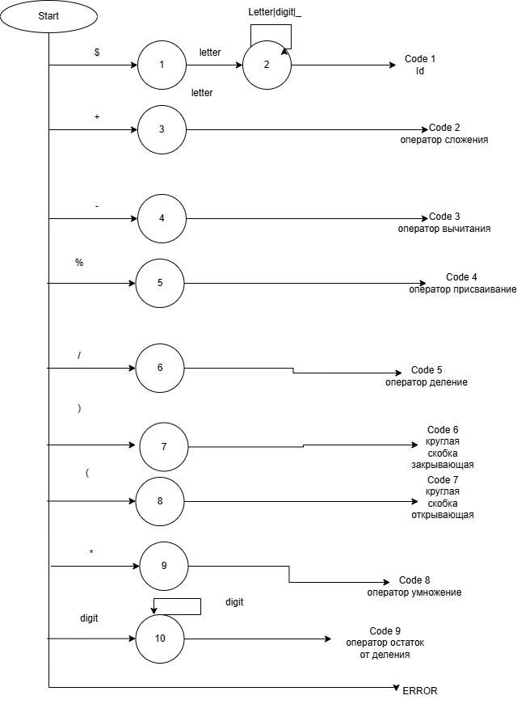<br>

**Схема рекурсивного спуска**<br>
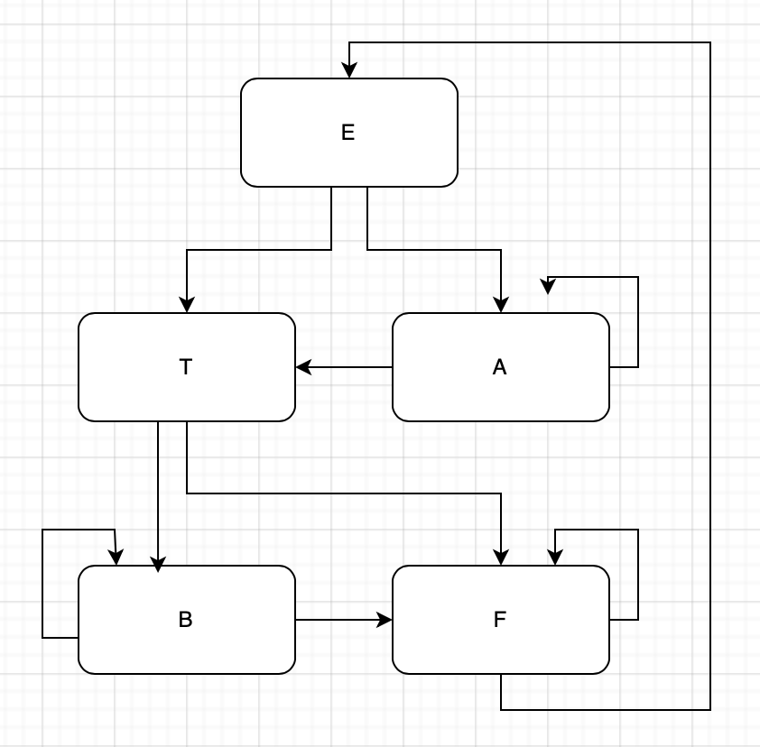<br>

**Скриншоты работы программы**<br>
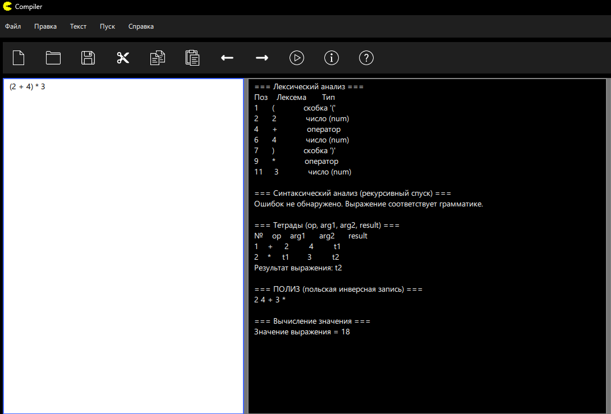<br>
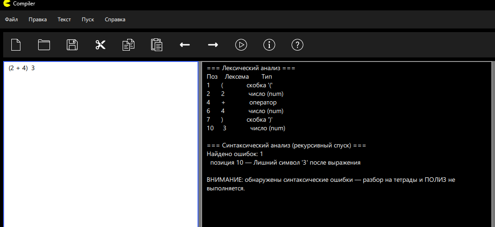<br>
## Лабораторная работа 5. Построение AST и проверка контекстно-зависимых условий

**Цель работы:** Изучить назначение и принципы работы семантического анализатора в структуре компилятора. Освоить методы построения абстрактного синтаксического дерева (AST) и проверки контекстно-зависимых условий (семантических правил) для заданной синтаксической конструкции.<br>

**Автор:** Косяченко Даниил, АВТ-313 <br>

**Постановка задачи:** Развить ранее созданный синтаксический анализатор (парсер) до семантического: построить абстрактное синтаксическое дерево (AST) и реализовать проверку контекстно-зависимых условий в соответствии с индивидуальным вариантом курсовой работы.<br>

**Вариант задания:** 30. Объявление прототипа функции на языке C\C++ 

**Корректные строки:**
   1. void asd();
   2. int dsa(short da);
   3. double sda(float net, int maybe);<br> 

**Контекстно-зависимые условия:** Прототип функции должен содержать в себе: уникальность названия функций и идентификаторов, допустимые типы(перечисленны в лабораторной работе 3).<br>

**Примеры:**

1. int dsa(short da); 
Ожидаемое сообщение: Ошибок нет :)<br>

2. void asd(void net);
Ожидаемое сообщение: Тип 'void' недопустим в качестве типа параметра <br>

**Структура AST**

Рисунок AST для верной строки<br>
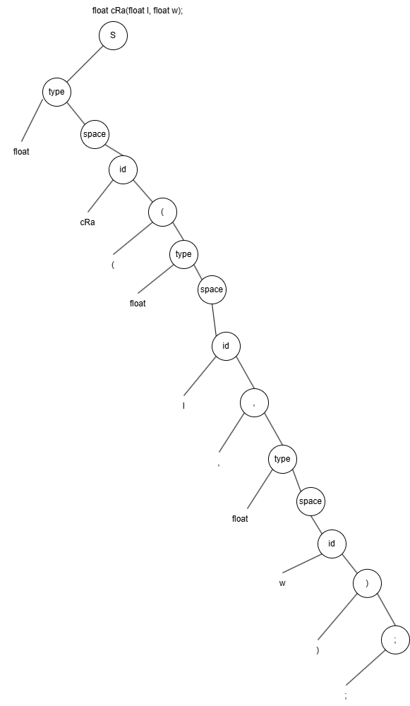<br>

Формат вывода AST в программе<br>
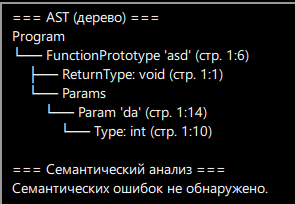<br>

**Тестовые примеры:**<br>
<br>

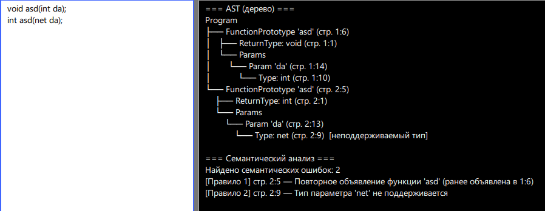<br>
## Лабораторная работа 4. Реализация алгоритма поиска подстрок с помощью регулярных выражений

**Цель работы:** Изучить теоретические основы регулярных выражений и их применение для поиска и извлечения подстрок из текста. Освоить практические навыки использования библиотечных средств работы с регулярными выражениями, а также интеграцию алгоритмов поиска в графический интерфейс приложения.

**Автор:** Косяченко Даниил, АВТ-313

**Постановка задачи:** Разработать модуль поиска подстрок с использованием регулярных выражений, интегрировать его в существующее приложение (текстовый редактор) и обеспечить наглядный вывод результатов.


**Задача 1**

Постановка задачи: Построить РВ для того, чтобы сопоставить все числа, которые начинаются на 9.

Итоговое регулярное выражение -> **\b9\d*\b** 

Разбор итогового регулярного выражения:

\b - граница слова.<br>
9 - первая цифра должна быть обязательно 9.<br>
\d* - любая цифра повторяемая любое кол-во раз. '*' - можно ничего.<br>
\b - граница конца слова.<br>


**Тестовый пример:**
```
В магазине было 9 яблок и 15 груш. Цена составила 99 рублей,
а доставка — 250 рублей. Номер заказа 9876, телефон горячей
линии 911. К сожалению, артикул 1992 не найден, зато товар
с кодом 9 есть на складе. Скидка действует с 19 по 29 число,
но только для покупок свыше 900 рублей. Версия программы 9.0,
сборка 91234. В 2019 году было продано 9000 единиц.
```
**Пример работы**
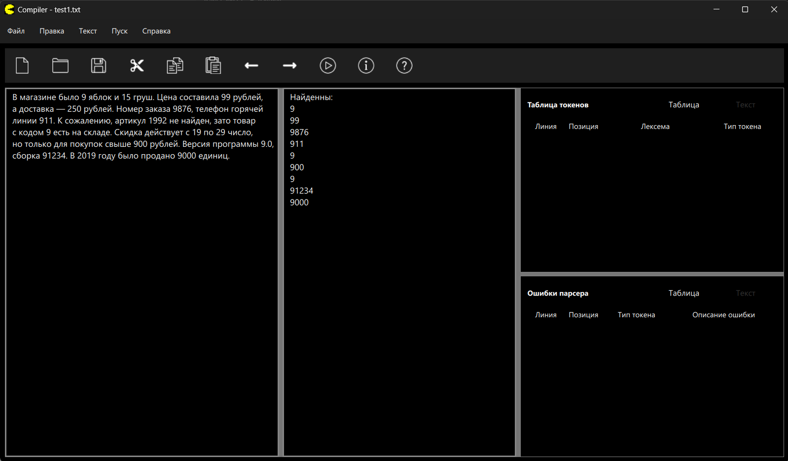


**Задача 2**<br>

Постановка задачи: Построить РВ, описывающее восьмеричные числа (с префиксами 0o, &O, 0).<br>

Итоговое регулярное выражение -> **\b(?:0[oO][0-7]+|&[oO][0-7]+|0[0-7]+)\b**<br>

Разбор итогового регулярного выражения:<br>

\b - граница слова<br>
?: - префикс группировки для альтернатив без сохранения отдельной подгруппы<br>
**Альтернатива 1: <br>**
0[oO][0-7]+ - начало с 0.[oO] - либо o, либо O. [0-7] - последовательность цифр от 0 до 7. (современный синтаксис восьмеричный чисел)<br>
Знак '+' обозначает, что без последовательности цифр не пойдёт.<br>
'|' - знак альтернативы<br>
**Альтернатива 2:**
&[oO][0-7]+ - начало с &. [oO] - либо o, либо O. [0-7] - последовательность цифр от 0 до 7. (синтаксис Visual Basic/Pascal)<br>
Знак '+' обозначает, что без последовательности цифр не пойдёт.<br>
**Альтернатива 3:**
0[0-7]+ - начало с 0(нуль).  [0-7] - последовательность цифр от 0 до 7. (Си - стиль). <br>
Знак '+' обозначает, что без последовательности цифр не пойдёт.<br>


**Тестовый пример:**<br>
```
В Python права доступа задаются как 0o755 для папок и 0o644
для файлов. В классическом C то же самое пишется как 0755
и 0644. Старый Visual Basic использовал префикс &O17 или
&o777. Однако 0789 не является валидным восьмеричным числом,
так как содержит цифру 8. Десятичное 123 тоже не подходит —
нет ведущего нуля. Шестнадцатеричное 0xFF — другой формат.
Используйте 017 для значения 15 или 0O1234567 для большого
числа. Просто 0 без цифр после — тоже не подойдёт.
```
**Пример работы**<br>
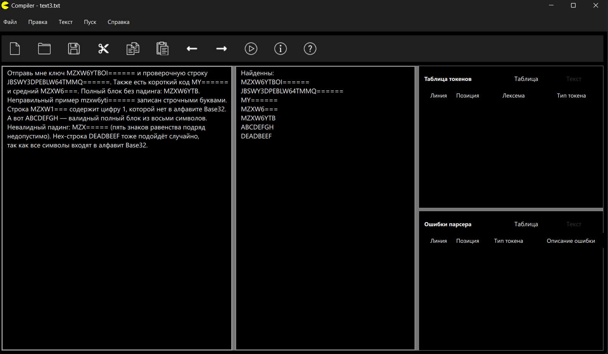


**Задача 3**<br>

Постановка задачи: Построить РВ для проверки данных на соответствие формату кодирования Base32.<br>

Итоговое регулярное выражение -> **(?:[A-Z2-7]{8})*(?:[A-Z2-7]{2}={6}|[A-Z2-7]{4}={4}|[A-Z2-7]{5}={3}|[A-Z2-7]{7}=|[A-Z2-7]{8})**

Разбор итогового регулярного выражения:<br>

?: - префикс группировки для альтернатив без сохранения отдельной подгруппы<br>
[A-Z2-7] - Алфавит Base32<br>
{8} - первые 8 символов алфавита Base32<br>
'*' - ноль или более повторений<br>

**Альтернатива 1:**<br>
[A-Z2-7] - Алфавит Base32<br>
{2}={6} - 2 символа данных + 6 знаков "="<br>

**Альтернатива 2:**<br>
[A-Z2-7] - Алфавит Base32<br>
{4}={4} - 4 cимвола данных + 4 знака "="<br>

**Альтернатива 3:**<br>
[A-Z2-7] - Алфавит Base32<br>
{5}={3} - 5 символов данных + 3 знака "="<br>

**Альтернатива 4:**<br>
[A-Z2-7] - Алфавит Base32<br>
{7}= - 7 символов данных + 1 знак "="<br>

**Альтернатива 5:**<br>
[A-Z2-7] - Алфавит Base32<br>
{8} - 8 знаков данных<br>

**Тестовый пример:**<br>
```
Отправь мне ключ MZXW6YTBOI====== и проверочную строку
JBSWY3DPEBLW64TMMQ======. Также есть короткий код MY======
и средний MZXW6===. Полный блок без падинга: MZXW6YTB.
Неправильный пример mzxw6yti====== записан строчными буквами.
Строка MZXW1=== содержит цифру 1, которой нет в алфавите Base32.
А вот ABCDEFGH — валидный полный блок из восьми символов.
Невалидный падинг: MZX===== (пять знаков равенства подряд
недопустимо). Hex-строка DEADBEEF тоже подойдёт случайно,
так как все символы входят в алфавит Base32.
```
**Пример работы**<br>
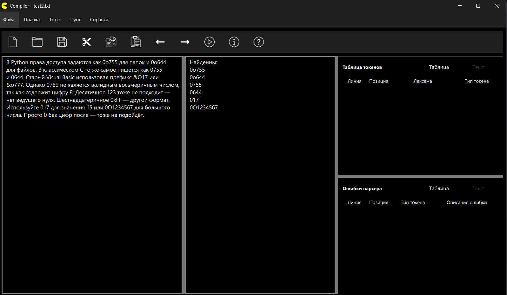


## Лабораторная работа 3. Разработка синтаксического анализатора (парсера)<br>
**Цель работы:** Изучить назначение и принципы работы синтаксического анализатора в структуре компилятора. Спроектировать грамматику, построить соответствующую схему метода анализа грамматики и выполнить программную реализацию парсера с нейтрализацией синтаксических ошибок методом Айронса. Интегрировать разработанный модуль в ранее созданный графический интерфейс языкового процессора.

**Автор:** Косяченко Даниил, АВТ-313

**Постановка задачи:** Разработать синтаксический анализатор (парсер) в соответствии с индивидуальным вариантом курсовой (расчетно-графической) работы, интегрировать его в приложение из лабораторной работы №1 и обеспечить наглядный вывод результатов анализа.

**Вариант задания:** 30. Объявление прототипа функции на языке C\C++ 

*Корректные строки:*

1. void f1();

2. int longNameFunc(int yes);

3. double func123(short da, int net);

*Перечень допустимых лексем:*

1. id (название функции, переменной) 
2. type (тип функции, переменной)
3. Открывающая круглая скобка (
4. Закрывающая круглая скобка )
5. точка с запятой ;

**Разработка грамматики**
```
1. <TYPE_FUNC> → type <AFTER_TYPE>
2. <AFTER_TYPE> -> ' ' <SPACE_AFTER_FUNC_TYPE>
3. <SPACE_AFTER_FUNC_TYPE> → id_func <ID_FUNC>
4. <ID_FUNC> -> letter <ID_FUNC> | digit <ID_FUNC> | '_' <ID_FUNC> 
5. <ID_FUNC> → '(' <PARAMS>
6. <PARAMS> → ')' <AFTER_RPAREN>
7. <PARAMS> → type <SPACE_TYPE_PARAMS> 
8. <SPACE_TYPE_PARAMS> -> ' '<PARAM_AFTER_SPACE_TYPE>
9. <PARAM_AFTER_SPACE_TYPE> → id_param <ID_PARAM>
10. <ID_PARAM> -> letter <ID_PARAM> | digit <ID_PARAM> | '_' <ID_PARAM>
11. <ID_PARAM> -> <PARAM_TAIL>
12. <PARAM_TAIL> → ',' <AFTER_COMMA>
13. <PARAM_TAIL> → ')' <AFTER_RPAREN>
14. <AFTER_COMMA> → type <SPACE_TYPE_PARAMS>
15. <SPACE_TYPE_PARAMS> -> ' ' <PARAM_AFTER_SPACE_TYPE>
16. <AFTER_RPAREN> → ';' <END>


Z = <TYPE_FUNC>

type = 'void' | 'int' | 'short' | 'float' | 'double'
Vt = {a, b, ..., z, A, B, ..., Z, 0, 1, ..., 9, (, ), ;, _}
Vn = 
{<TYPE_FUNC>, <AFTER_TYPE>, <SPACE_AFTER_FUNC_TYPE>, 
<ID_FUNC>, <PARAMS>, <AFTER_RPAREN>,
<SPACE_TYPE_PARAMS>, <PARAM_AFTER_SPACE_TYPE>, <ID_PARAM>,
<PARAM_TAIL>, <AFTER_COMMA>, <AFTER_RPAREN>, <END>} 
```

**Классификация грамматики по Хомскому: Автоматная грамматика**


**Граф автоматной грамматики**


**Диагностика и нейтрализация синтаксических ошибок.**

Метод Айронса заключается в том, что он определяет дефектный куст (фрагмент с ошибками), нейтрализует его (вставляя туда недостающую цепочку) и идет дальше по строке. Таким образом, можно учесть все ошибки.

**Пример работы**

## Лабараторная работа 2. Разработка лексического анализатора (сканера)
**Цель работы** - Изучить назначение и принципы работы лексического анализатора в структуре компилятора. Спроектировать алгоритм (диаграмму состояний) и выполнить программную реализацию сканера для выделения лексем из входного текста. Интегрировать разработанный модуль в ранее созданный графический интерфейс языкового процессора

**Автор:** Косяченко Даниил, АВТ-313

**Вариант задания:** 30. Объявление прототипа функции на языке C\C++ 

*Корректные строки:*

1. void f1();

2. int longNameFunc(int yes);

3. double func123(short da, int net);

*Перечень допустимых лексем:*

1. id (название функции, переменной) 
2. type (тип функции, переменной)
3. Открывающая круглая скобка (
4. Закрывающая круглая скобка )
5. точка с запятой ;

**Диграмма состояний**
letter - латинская буква, digit - цифра от 0 до 9


**Тестовые примеры(сканер)**

1. void asd();


2. int dsa(int net);


3. void dada(short what, int notWhat);
   int netnet(float yes, double maybe);


## Лабораторная работа 1. Разработка пользовательского интерфейса (GUI) для языкового процессора 
**Цель работы** - создание кроссплатформенного графического интерфейса (GUI) для языкового процессора в виде специализированного текстового редактора
**Автор:** Косяченко Даниил, АВТ-313
**Описание проекта:** Проект представляет собой текстовый редактор со всеми основными функциями для работы с txt файлами.
**Используемые технологии:** Проект реализован для операционной системы Windows 10\11  с использованием языков программирования С++ и QML (Qt) . Разработан в VS Code
**Для запуска программы необходимо иметь:**
1. Visual Studio 2022\2026
2. CMake
3. Статическую сборку Qt 6.10.2
4. Компиляторо с поддержкой C++17
5. x64 Native Tools Command Prompt for VS 2022
**Сборка проекта**
1. ```bash cmake .. -G Ninja -DC_MAKE_BUILD_TYPE=Release "-DQt6_DIR=ДИРЕКТОРИЯ_С_СТАТИЧЕСКОЙ_СБОРКОЙ_Qt_\lib\cmake\Qt6"```
2.  ```bash cmake --build . --parallel```

**Описание интерфейс и функций:**
1. Основное окно программы

Верхняя панель - это многоуровневое меню со всеми функциями приложения. Под ней панель инструментов, которая дублирует основные функции меню. На панели инструментов есть следующие функции (вызываются при нажатии на иконки): "Создать", "Открыть", "Сохранить", "Отмена", "Повторить", "Вырезать", "Вставить", "Пуск", "Справка", "О программе".


Правее расположено окно редактирования, рядом с ним окно вывода результатов, рядом с окном результатов расположено окно для таблиц. В окне редактирования можно работать с txt файлами с помощью функций текстового редактора, окно вывода результатов показывает отладочные сообщения и ошибки. Окно редактирования нумерует строки и подсвечивает ключевые слова.


2. Раздел "Файл" и раздел "Правка"

Все функции этих разделов, которые можно вызвать при нажатии на элемент меню, либо с помощью горячих клавиш. Открыть файл можно так же с помощью перетаскивания иконки файла в окно программы.


**Ограничения**
1. Данная программа разработана на платформе Windows 10\11. Корректная работа на иных операционных системах не гарантируется
2. Таблица имеет фиксированный размер. Отсутствует возможность "растягивания"
3. Интерфейс не имеет перевода на английский язык


